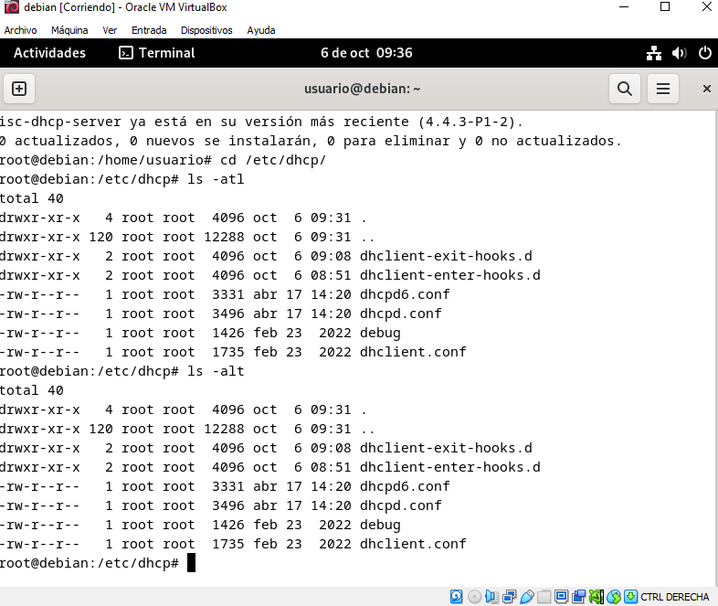

## Indice
[Inicio](#1introducción)

[Configuracion de la dirección ip](#2configuracion-de-la-dirección-ip)

[Instalacion del servidor](#3instalación-del-servidor)
 
[Configuración de la tarjeta que debe escuchar](#4configuración-de-la-tarjeta-que-debe-escuchar)

[Ejemplo práctico](#5ejemplo-práctico)
## 1.Introducción
En este documento vamos a instalar un servidor DHCP en Debian. El nombre del software es isc-dhcp-server.
## 2.Configuracion de la dirección ip
El equipo donde vayamos a realizar la instalación deberá tener configurada una dirección ip estática, es decir, fija que habrás configurado manualmente.

Para ver si la configuracion de red se cambio ponemos el siguiete comando
`` ip a``
## 3.Instalación del servidor
1. Cambiar al usuario root o ejecutar todos los comandos con sudo.

    ``` su - ```

2. Ejecutar el comando de instalacion del paquete **isc-dhcp-server**

    ``` apt-install isc-dhcp-server```

## 4.Configuración de la tarjeta que debe escuchar
Para indicar al servicio cuál es la tarjeta de red a través de la cual se recibirán las peticiones DHCP, se debe modificar el archivo /etc/default/dhcp/isc-dhcp-server
editandolo por ejemplo con el editor de texto **nano**.

``` nano /etc/default/dhcp/isc-dhcp-server```
## 5.Ejemplo práctico 
1-Cambiamos la configuracion de la tarjeta de red

2-Instalamos el paquete isc-dhcp-server

3-Abrimos el archivo /etc/default/isc-dhcp-server

4-Entramos en /etc/dhcp/ y hacemos un ls

5-Ahora hacemos una copia de dhcpd.conf

6-Abrimos el archivo dhcp.conf i empezamos la configuracion

7-Ponemos el rango de ip para asignar

8-Ponemos la mac de la red interna y hacemos la reserva de la ip 192.168.xx.60

9-Ahora iniciamos el isc-dhcp-server

10-Entramos en /var/lib/dhcp/ y hacemos un ls

11-Ahora iniciamos un window 10 y comprobamos que se le asigno una ip y que pertenece el dhcp

12-Ahora regresamos al ubuntu y hacemos un cat de dhcpd.leases para ver que se le asigno la ip al windows10

Instalamos el paquete nsyslog

Hacemos tail -f /var/log/syslog para ver lo que tenemos en el pauete syslog

O tambien podemos hacer el mismo comando pero añadiendo | grep dhcp para añadir un filtro

Por ultimo reiniciamos el servicio del que queramos encontrar los errores. Y los comprobamos con el comando journalctl -u isc-dhcp-server.service 

Aqui vemos que la reserva funciono
